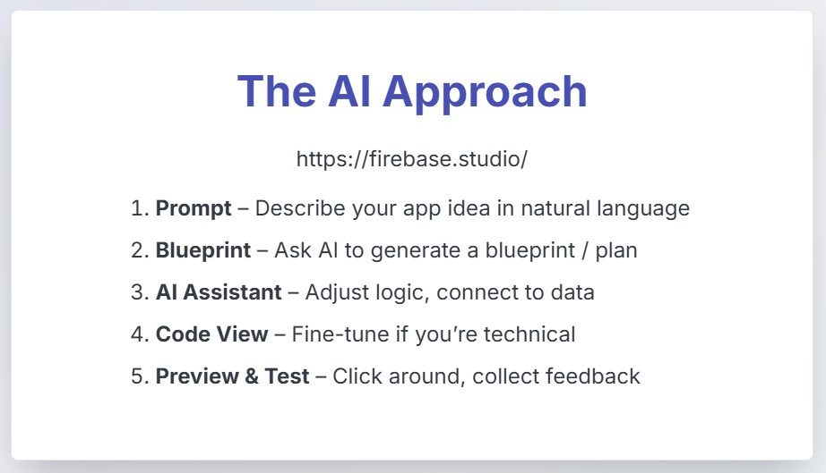

# From Idea to Prototype – Presentation Project

**Date:** 16/08/2015  
**Author:** tomek-i

This repository contains materials and code for my presentation: **"From Idea to Prototype"**. The project demonstrates how to transform a concept into a working prototype, illustrating every step from ideation to implementation.

## Project Overview

The goal of this project is to showcase the journey from initial idea to prototype using modern web technologies like AI. 
The presentation covers the process, and decisions involved in bringing an idea to life.

## Presentation Slides

Below are the slides from the "From Idea to Prototype" presentation:

📖 View All Slides (Click to expand)

### Slide 1

### Slide 2

### Slide 3

### Slide 4

### Slide 5

### Slide 6

### Slide 7

### Slide 8

### Slide 9

### Slide 10

### Slide 11

### Slide 12

### Slide 13

## Technologies Used

- **Firebase Studio** - https://firebase.studio
- **TypeScript** (primary language)
- **CSS**
- **Other**

## Repository Structure

- Source code: `src/`
- Main entry point: `src/app/page.tsx`
- Presentation assets and demo flows included

## Getting Started

To run or modify the prototype locally:

1. Clone the repository.
2. Install dependencies with `npm install`.
3. Start the development server: `npm run dev`.
4. Open your browser to the local address provided.

## Additional Resources

- [Presentation Blueprint](docs/blueprint.md) - Detailed presentation notes and structure

## License

This repository is for educational and demonstration purposes.
